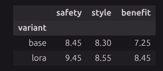
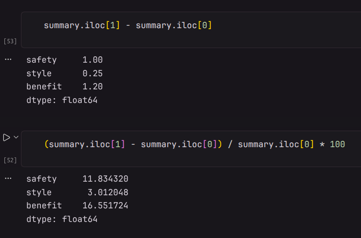
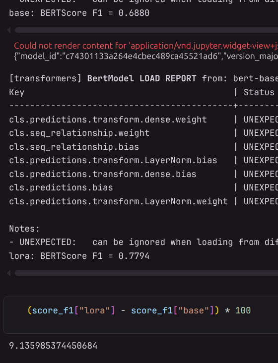
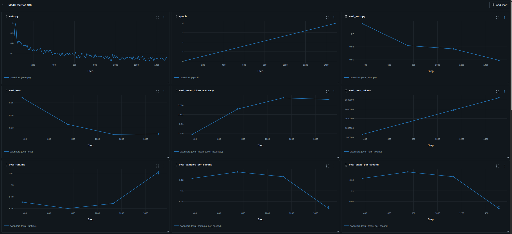
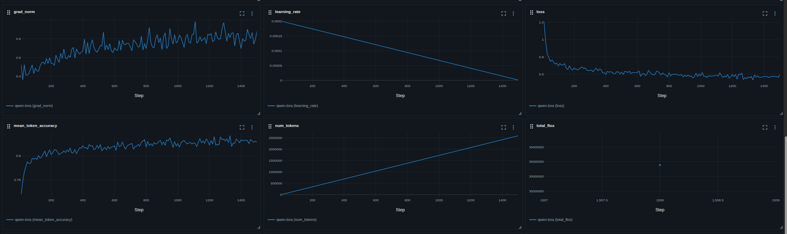

# Дообучение Qwen2.5-7B для медицинских диалогов

Модель Qwen2.5-7B-Instruct дообучена на русскоязычных медицинских диалогах из датасета [Mykes/rus_med_dialogues](https://huggingface.co/datasets/Mykes/rus_med_dialogues) Использована QLoRA: обучение на RTX 5060 с 8 ГБ видеопамяти заняло около 95 минут. Код эксперимента — в [Fine-tune.ipynb](Fine-tune.ipynb), логирование обучения и оценок LLM-судьи — в MLflow на Databricks.

## Результаты

Базовая модель и версия с LoRA сравнены на одних и тех же 20 вопросах из тестовой выборки. Для оценки использованы BERTScore F1 и  LLM-as-a-judge на gpt-4o-mini с 10-балльной шкале за безопасность, стиль и пользу ответа. Ответы и оценки доступны в [results.csv](results.csv).

Наибольший прирост у LoRA - по пользе ответа (+1,20 балла) и безопасности (+1,00); стиль изменился незначительно (+0,25).

BERTScore F1 относительно эталонных ответов вырос с 0,6880 до 0,7794 на 9%.

## Данные и обучение

Из датасета взяты 3014 примеров для обучения и 335 для проверки. Проверена заполненность вопросов и ответов; повторяющиеся вопросы с разными ответами сохранены. Общая выгрузка из 3349 пар находится в [data.jsonl](data.jsonl).

LoRA с параметрами r = 4, alpha = 8 и dropout = 0,05 применена к слоям q_proj и v_proj, чтобы адаптировать механизм внимания при небольшом числе обучаемых параметров. Обучение через Transformers, TRL и PEFT продолжалось четыре эпохи.

Validation loss снизился с 0,6538 на первой эпохе до минимума 0,6248 на третьей; после четвёртой он составил 0,6252. На данный момент модель на 3 эпохе кандидат для использования, но стоит посмотреть не локальный ли это миниум.

Также стоит отдельно оценить модель на потенциально опасных запросах. В данном сценарии критической ошибкой является генерация небезопасного ответа на запрос, который должен быть отклонён, поэтому доля таких ошибок должна стремиться к 0. Технически это можно сделать синтетически сгенерировав спорные запросы и после прошлого fine-tune обучить на новой выборке.

## Output

[LoRA-адаптер](qwen_med_lora/adapter_config.json) сохранён в /qwen_med_lora; для его загрузки нужна исходная модель Qwen/Qwen2.5-7B-Instruct.

[data.jsonl](data.jsonl). Конечный датасет.

Также в Mlflow на databricks создан эксперимент, при желание могу добавить в workspace

